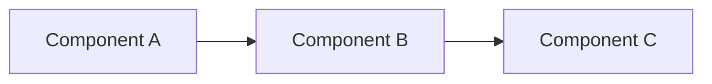

# Databricks Well-Architected Framework - Style Guide

This guide ensures consistency in tone, voice, and formatting across all documentation in the Databricks Well-Architected Framework.

## Core Principles

### 1. Authoritative but Not Dogmatic
- Provide clear guidance while acknowledging trade-offs
- Present options with rationale rather than absolute rules
- Use "Recommended" or "Consider" instead of "Must" (except for security/compliance)

**Good**: "Use SaaS deployment for rapid deployment and minimal operational overhead."
**Avoid**: "SaaS deployment is the best option for all scenarios."

### 2. Practical and Action-Oriented
- Focus on "how" and "why" with concrete examples
- Include implementation guidance, not just theory
- Provide clear next steps

**Good**: "Configure Unity Catalog at the account level to enable centralized governance."
**Avoid**: "Unity Catalog provides governance capabilities that organizations might find useful."

### 3. Neutral and Objective
- Avoid marketing language and hyperbole
- Base recommendations on technical merit and trade-offs
- Acknowledge limitations alongside benefits

**Good**: "This approach provides better isolation but increases operational complexity."
**Avoid**: "This revolutionary approach delivers unprecedented isolation capabilities!"

### 4. Concise and Scannable
- Use bullet points, tables, and clear headings
- Front-load important information
- Limit paragraphs to 3-4 sentences

### 5. Inclusive of Experience Levels
- Define technical terms on first use
- Provide context without over-explaining
- Link to deeper resources for advanced topics

## Voice and Tone

### Active Voice
Use active voice for clarity and directness.

**Good**: "Deploy the workspace in your preferred region."
**Avoid**: "The workspace should be deployed in your preferred region."

### Present Tense
Write in present tense for current capabilities and guidance.

**Good**: "Unity Catalog manages permissions at the catalog level."
**Avoid**: "Unity Catalog will manage permissions at the catalog level."

### Second Person (You/Your)
Address the reader directly when providing guidance.

**Good**: "Choose your deployment model based on data residency requirements."
**Avoid**: "One should choose their deployment model based on data residency requirements."

### No Superlatives
Avoid absolute terms and superlatives.

**Replace with:**
- "best" → "recommended", "suitable", "effective"
- "perfect" → "appropriate", "well-suited"
- "always/never" → "typically/rarely", "generally"
- "revolutionary" → "significant", "notable"
- "seamless" → "integrated", "straightforward"

## Formatting Standards

### Headings
- Use sentence case for all headings: "Choosing the right deployment model"
- Not title case: ~~"Choosing the Right Deployment Model"~~
- H1 (#) for page title (matches frontmatter title)
- H2 (##) for main sections
- H3 (###) for subsections
- H4 (####) for detailed breakdowns

### Lists
**Bulleted lists** for non-sequential items:
```markdown
- Feature A provides X capability
- Feature B enables Y functionality
- Feature C supports Z use case
```

**Numbered lists** for sequential steps:
```markdown
1. Configure the workspace settings
2. Enable Unity Catalog
3. Create the metastore
```

### Tables
Use tables for comparisons and specifications:
```markdown
| Factor | Option A | Option B |
|--------|----------|----------|
| Cost | Lower | Higher |
| Control | Limited | Full |
```

### Code and Technical Terms
- Use `inline code` for: commands, file names, parameters, API calls
- Use code blocks for: examples, configurations, scripts
- Bold (**term**) technical terms on first use in a section

### Emphasis
- **Bold** for key terms and important concepts
- *Italics* sparingly for subtle emphasis
- Use callout boxes for warnings, tips, and notes

### Links
- Use descriptive link text: [workspace configuration guide]
- Avoid: "click here" or "read more"
- Link to official Databricks docs for platform features
- Use relative links for internal framework pages

## Word Choice and Terminology

### Consistent Terms
Use these terms consistently throughout:

| Use This | Not This |
|----------|----------|
| Organization | Company, business, enterprise |
| Deployment model | Deployment type, deployment option |
| Data plane | Data layer, data tier |
| Control plane | Control layer, management plane |
| Workspace | Environment, instance |
| Unity Catalog | UC (spell out on first use, then UC acceptable) |
| Multi-tenant | Multitenant, multi tenant |
| Account-level | Account level, account wide |

### Databricks-Specific Terminology
- **Workspace**: A Databricks environment containing notebooks, clusters, jobs
- **Metastore**: Unity Catalog's top-level container for data objects
- **Catalog**: A grouping of databases/schemas in Unity Catalog
- **Compute**: Clusters and SQL warehouses (not "servers")
- **Notebook**: Interactive document for code and visualizations
- **Job**: Automated workflow or scheduled task

### Industry Terms
- **SaaS**: Software as a Service (spell out on first use)
- **IaaS**: Infrastructure as a Service (spell out on first use)
- **IdP**: Identity Provider (spell out on first use)
- **SCIM**: System for Cross-domain Identity Management (spell out on first use)

## Content Structure Patterns

### Architecture Pattern Pages
```markdown
---
title: [Pattern Name]
description: [One-line description of the pattern]
---

# [Pattern Name]

[2-3 sentence overview explaining what this pattern is and its primary purpose]

## When to use this pattern

**Best for:** [Specific use cases, 1-2 sentences]

[Additional context on scenarios where this pattern excels]

## Key considerations

### [Consideration 1: e.g., Cost]
[Explanation of cost implications and trade-offs]

### [Consideration 2: e.g., Complexity]
[Explanation of operational complexity]

### [Consideration 3: e.g., Security]
[Explanation of security implications]

## Implementation

[Step-by-step guidance or architectural decisions]

## Example

[Concrete example or reference architecture]

## Related patterns

- [Link to related pattern]
- [Link to alternative pattern]
```

### Comparison Pages
Use tables prominently:
```markdown
# Comparing [Option A] vs [Option B]

## Quick comparison

| Factor | Option A | Option B |
|--------|----------|----------|
| [Factor 1] | [Value] | [Value] |

## Detailed analysis

### [Factor 1]
[Detailed explanation]
```

### Getting Started Pages
```markdown
# Getting started with [Topic]

[Brief overview, 2-3 sentences]

## Prerequisites

- [Prerequisite 1]
- [Prerequisite 2]

## Steps

1. [Step 1 with command or screenshot]
2. [Step 2 with command or screenshot]

## Next steps

- [Link to next logical topic]
- [Link to advanced configuration]
```

## "Best for" Pattern

Every deployment model, architecture pattern, or major decision point should include a "Best for:" section:

```markdown
**Best for:** [Specific use case or organization type]
```

**Examples:**
- **Best for:** Organizations prioritizing rapid deployment and minimal operational overhead
- **Best for:** Government agencies with strict data residency requirements
- **Best for:** Multi-product companies requiring complete resource isolation

## Examples Section

When providing examples:
1. Use realistic scenarios based on actual use cases
2. Include context about why the example is relevant
3. Provide code/configuration samples when applicable
4. Use placeholder names that are clear: `acme-prod-workspace`, `user@example.com`

## Diagrams and Visuals

### Mermaid Diagrams
Use Mermaid for architecture diagrams:
```markdown

```

### Diagram Guidelines
- Keep diagrams simple and focused on one concept
- Use consistent shapes: rectangles for services, cylinders for data stores
- Label all connections
- Use color sparingly and consistently

## Common Phrases to Avoid

| Avoid | Use Instead |
|-------|-------------|
| "It's easy to..." | "You can..." or "To [achieve X]..." |
| "Simply..." | Remove or "To [do X]..." |
| "Just..." | Remove or be specific |
| "Obviously..." | Remove entirely |
| "Clearly..." | Remove entirely |
| "As you can see..." | Remove or be specific |
| "In order to..." | "To..." |
| "Due to the fact that..." | "Because..." |

## Writing Checklist

Before submitting documentation, verify:

- [ ] Headings use sentence case
- [ ] Technical terms are bolded on first use
- [ ] "Best for:" sections included for patterns
- [ ] Active voice used throughout
- [ ] No superlatives or marketing language
- [ ] Tables used for comparisons
- [ ] Code and commands use inline code formatting
- [ ] Links use descriptive text
- [ ] Consistent terminology per this guide
- [ ] Paragraphs are concise (3-4 sentences max)
- [ ] Examples are practical and realistic
- [ ] Diagrams are labeled and clear

## Questions?

When in doubt:
1. Prioritize clarity over cleverness
2. Be specific over being comprehensive
3. Show over tell (use examples)
4. Guide over prescribe (acknowledge trade-offs)

For questions about this style guide or suggestions for improvements, please open an issue or submit a pull request.
